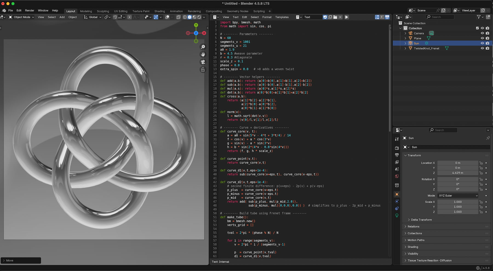
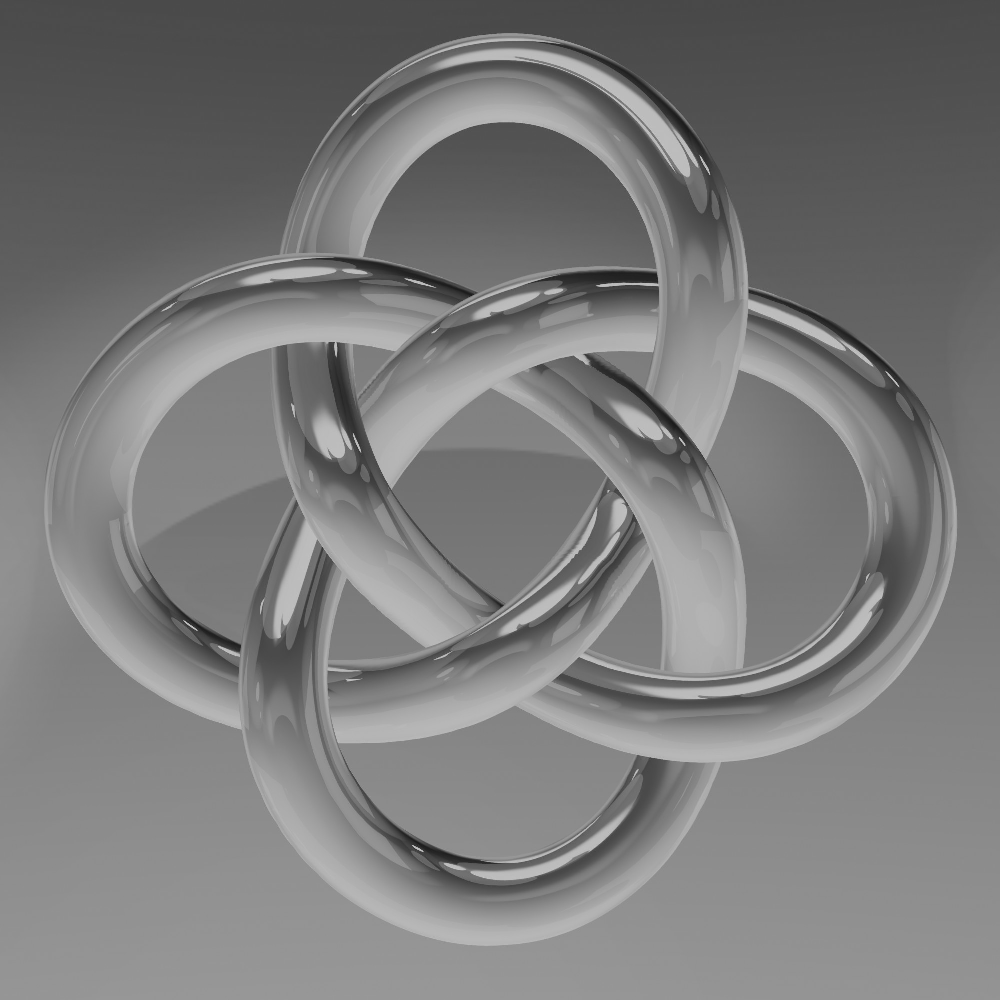

# Project Overview: Braided Knot
The project is a custom Blender 3D Python script that generates a 3D Braided Knot.

## Screen Shot

## Documentation
the script is easy to handle. In the top / and or in the bottom/ of the script you find a short set of parameter with a short description. 

| Object  |
| :---  |
|  |

## Release Notes

### v1.0.0 (July 31, 2026)
- **Publishing**: First public upload of this script

## Blender

