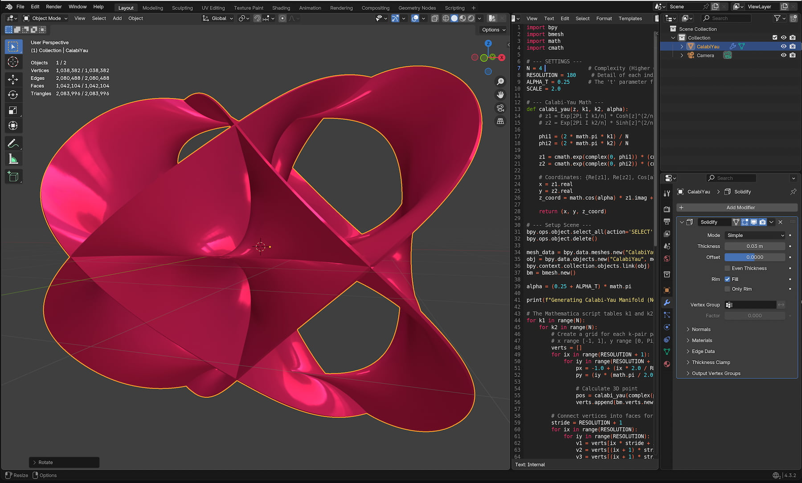
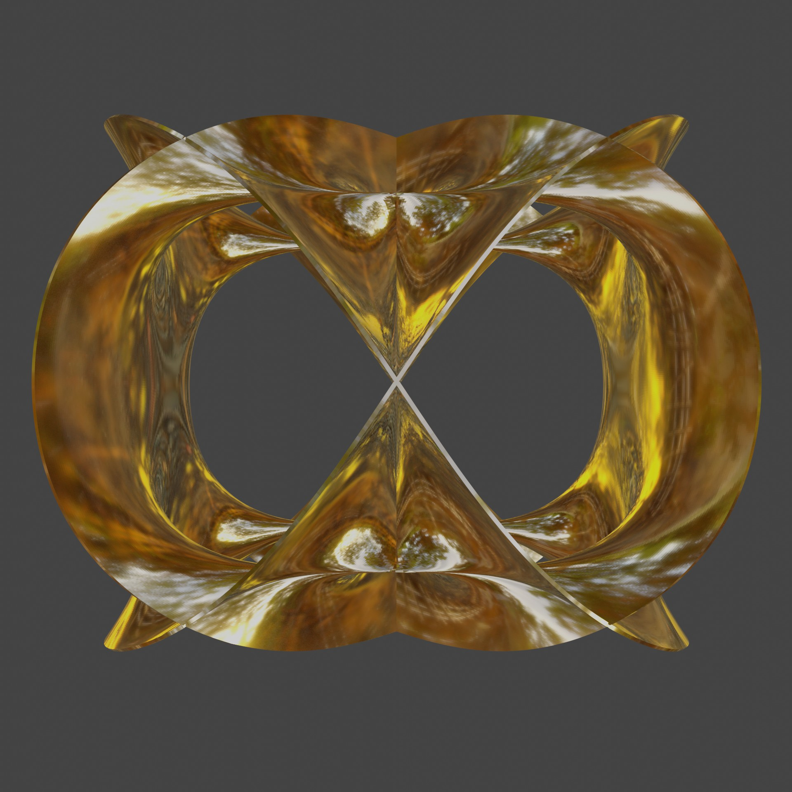
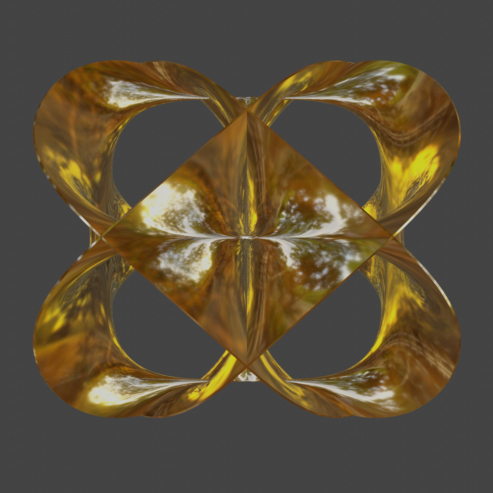

# Project Overview: Calabi-Yau
The project is a custom Blender 3D Python script that generates a Variation of Calabi-Yau Surface.

# Calabi-Yau
The Calabi-Yau surface model is a complex geometric space used in theoretical physics to compactify the extra, unseen spatial dimensions required by string theory. It provides a framework where the universe's hidden dimensions are tightly curled up into microscopic shapes, which in turn dictates the fundamental forces and particles of our observable four-dimensional spacetime

## Screen Shot

## Documentation
the script is easy to handle. In the top / and or in the bottom/ of the script you find a short set of parameter with a short description. 

| Object | Preview |
| :--- | :--- |
|  |  |

## Release Notes

### v1.0.0 (July 28, 2026)
- **Publishing**: First public upload of this script

## Blender

