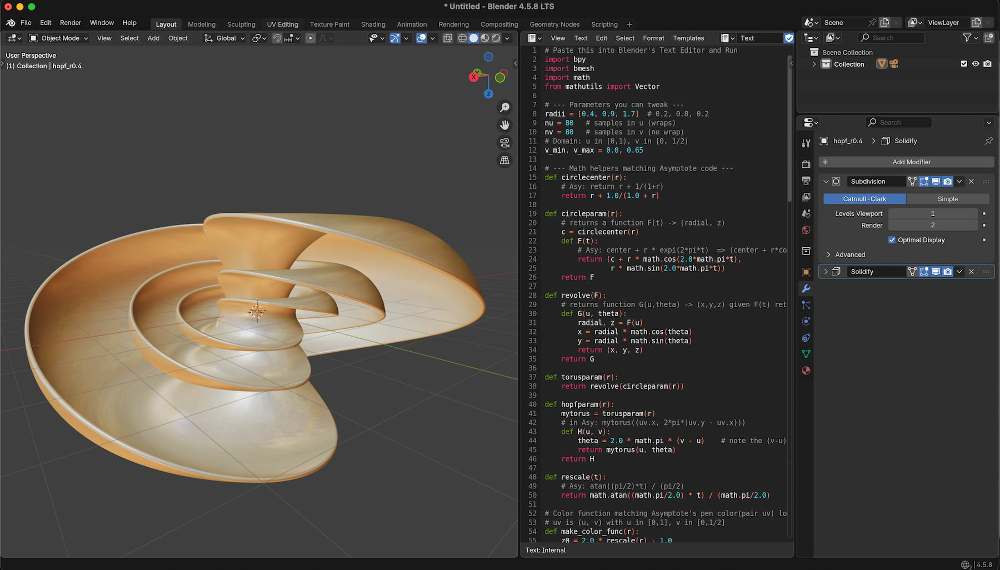
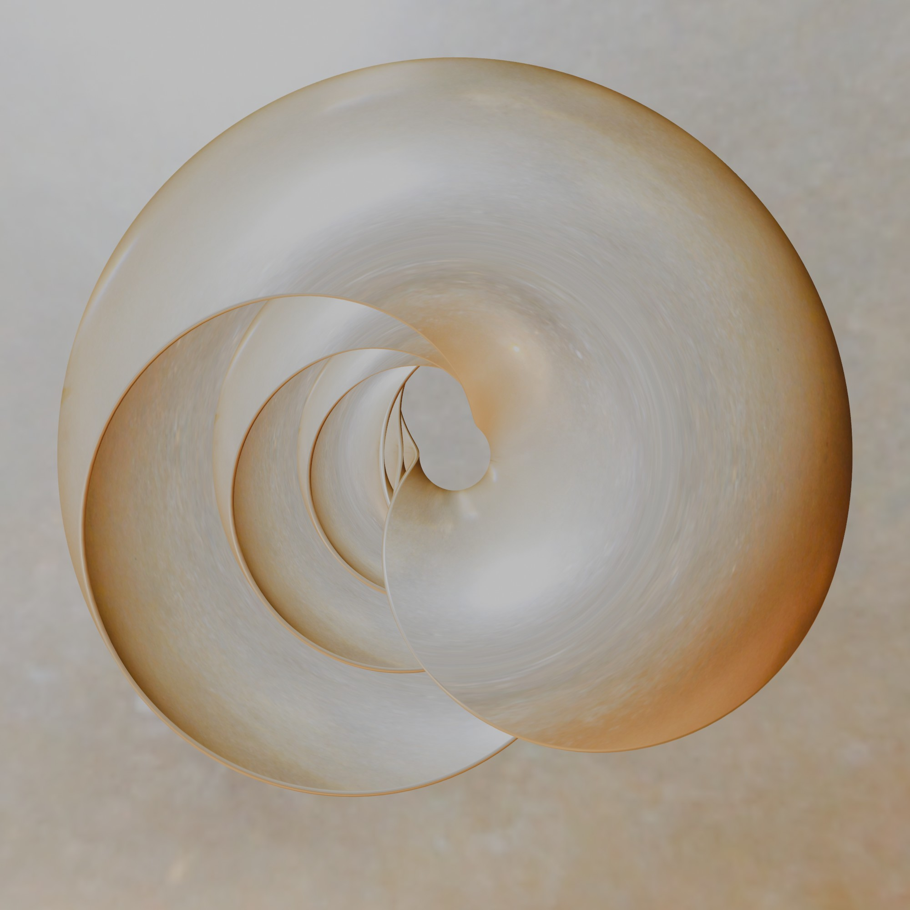
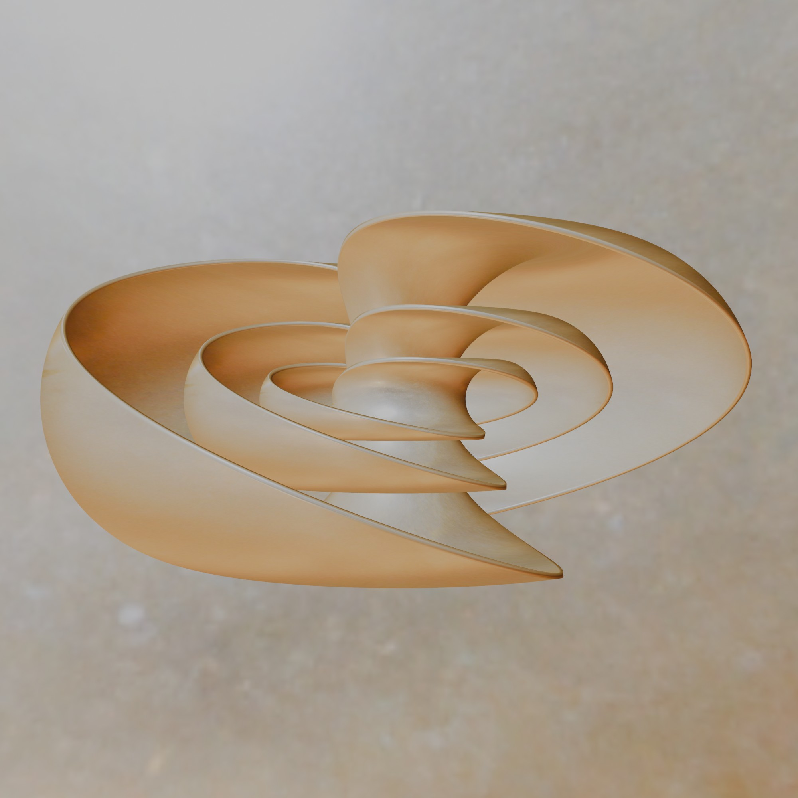

# Project Overview: Hopf Fibration
The project is a custom Blender 3D Python script that generates the Hopf fibration.

## Background
The Hopf Fibration is a fundamental mathematical mapping from the subfield of topology that divides a three-dimensional sphere into circles such that these circles correspond exactly to the points of an ordinary two-dimensional sphere's surface (S²). This structure was discovered in 1931 by the mathematician Heinz Hopf.

## Screen Shot

## Documentation
the script is easy to handle. In the top / and or in the bottom/ of the script you find a short set of parameter with a short description. 

| Object1  | Object2  | 
| :---  | :---  |
|  |   |

## Release Notes

### v1.0.0 (July 31, 2026)
- **Publishing**: First public upload of this script

## Blender

