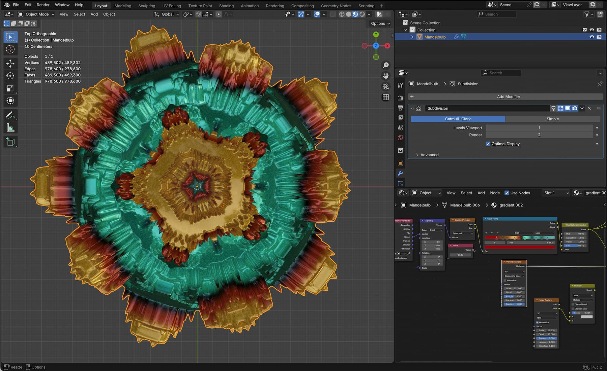
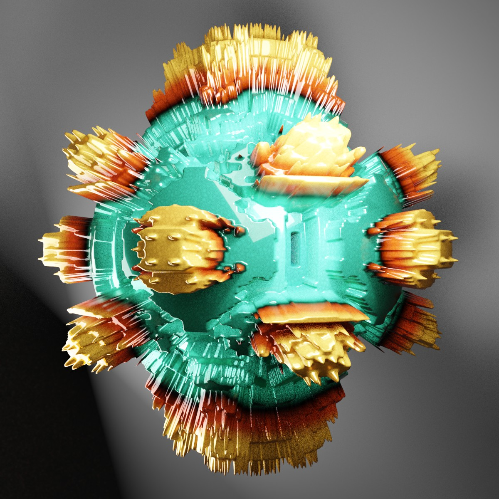
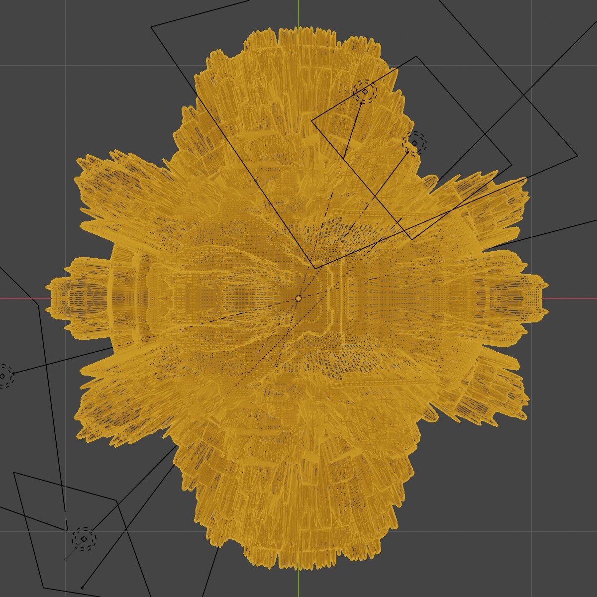
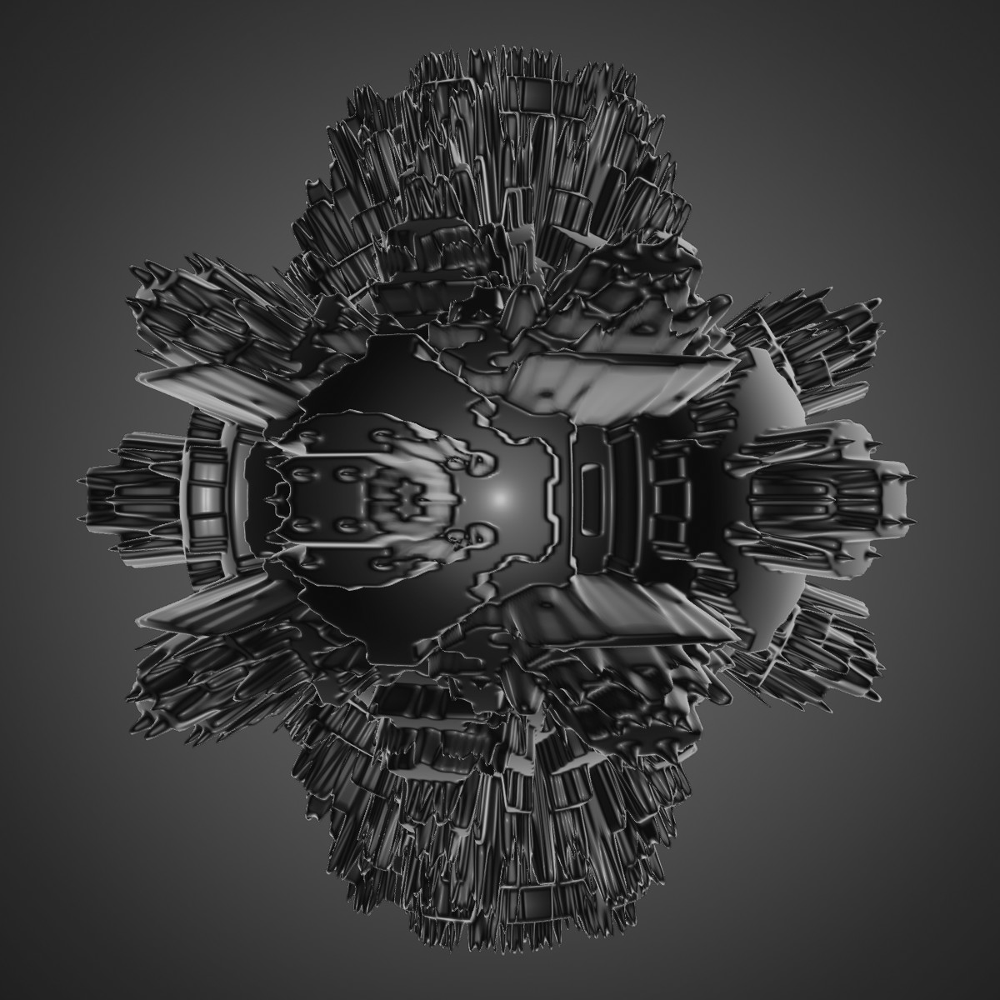

# Project Overview: Mandelbulb Generator
The project is a custom Blender 3D Python script that generates a mandelbulb object. It could be the base of a future add-on.

## Background

The Mandelbulb is a three-dimensional fractal. It was developed in 2009 by Daniel White and Paul Nylander because there is no direct three-dimensional equivalent of the complex numbers for the classical Mandelbrot set. Instead, the formula is approximated in three-dimensional space using spherical coordinates.

## Screen Shot

## Documentation
the script is easy to handle. In the top of the script you find a short set of parameter with a short description. Also there is *.blend File with a basic preview (Version 4.3.2)

| Object | Preview |
| :--- | :--- |
|  |  |
|  |  |

## Release Notes

### v1.0.0 (July 28, 2026)
- **Publishing**: First public upload of this script

## Blender

