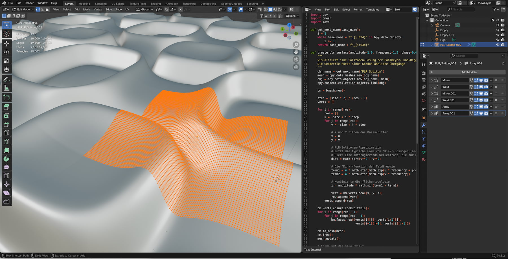

# Project Overview: Pohlmeyer-Lund-Regge
This Script visualizes a soliton solution to the Pohlmeyer-Lund-Regge equation.

## Background
This Script visualizes a soliton solution to the Pohlmeyer-Lund-Regge equation. The geometry uses sine-Gordon-like transitions. The Pohlmeyer-Lund-Regge equation (PLR equation) is a system of nonlinear partial differential equations. It is considered an integrable extension of the sine-Gordon equation and geometrically describes the evolution of curves as well as special flatness conditions in theoretical physics and mathematical geometry.
    
## Screen Shot

## Documentation
the script is easy to handle. In the top / and or in the bottom/ of the script you find a short set of parameter with a short description. 

| Object |
| :--- |
|  |

## Release Notes

### v1.0.0 (July 31, 2026)
- **Publishing**: First public upload of this script

## Blender

