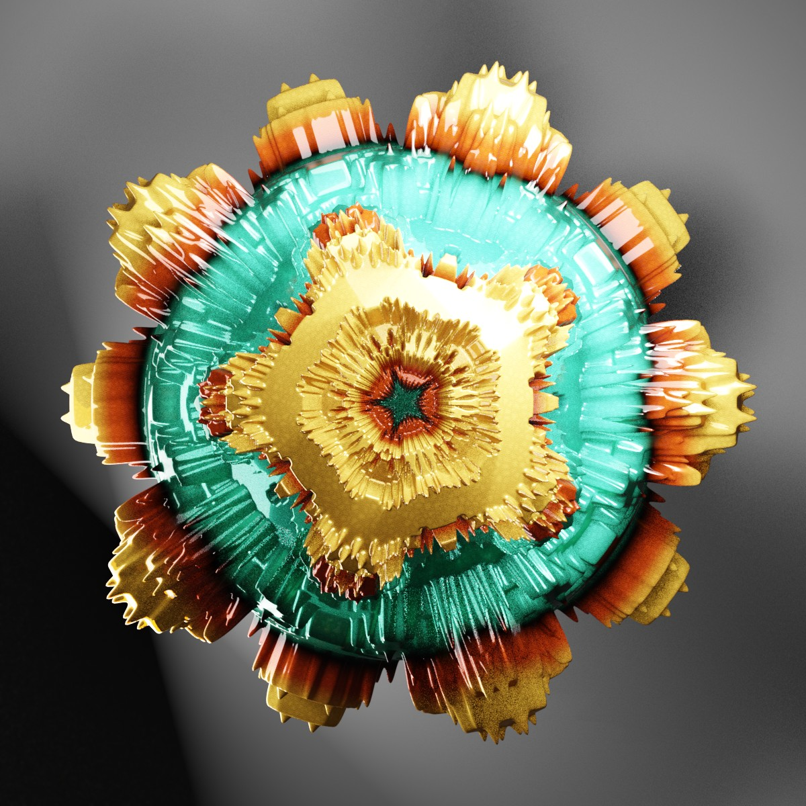
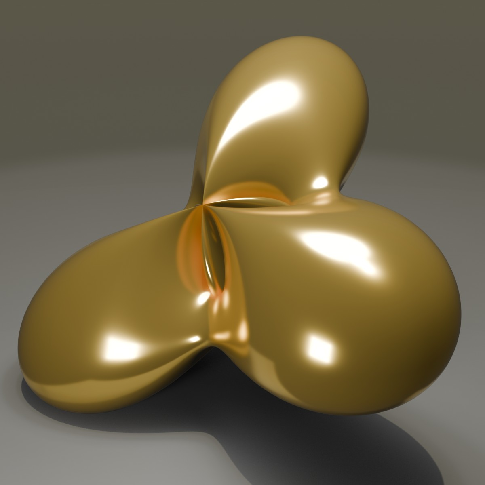
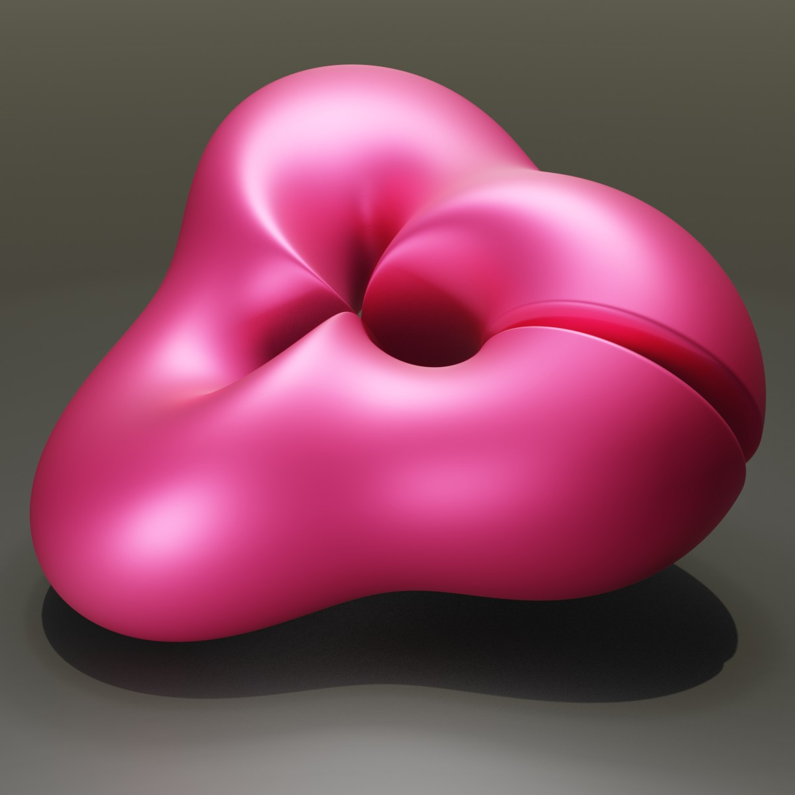
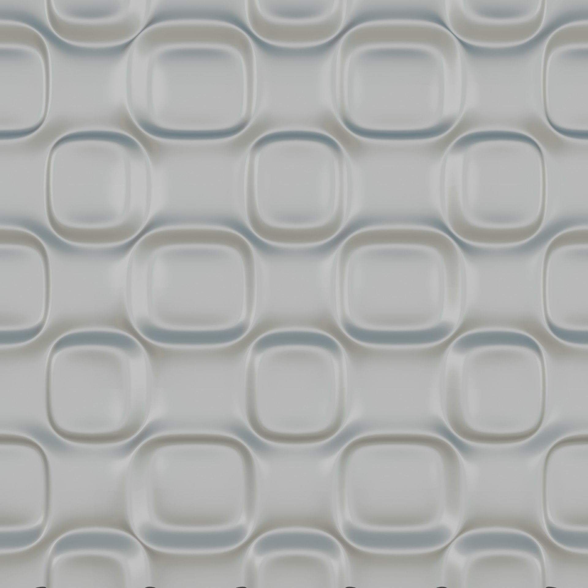
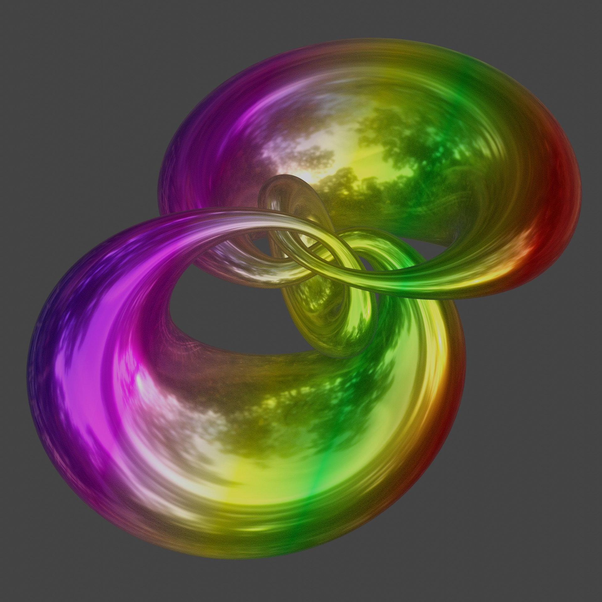
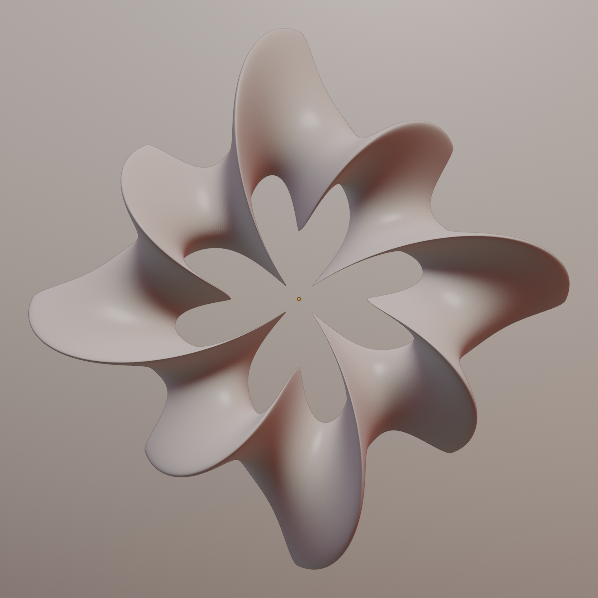

  

# Python Scripts Math Objects Volume II
A collection of Python Scripts to generate various Math Objects in Blender. All those objects are generated with python script inside Blender. To use them just copy and paste the code inside the text environment in Blender and run the script. Most scripts have a "parameter" area, where it is possible to adjust the look of the objects. 

## 📂 Phyton-Scripts

Here is the table of Blender Scripts with a small preview:

| Object | Description | Preview |
| :--- | :--- | :--- |
| **[MANDELBULB](./Mandelbulb/)** | The Mandelbulb is a three-dimensional fractal. |  |
| **[WENTE](./WenteTorus/)** | A Wente torus is a special 3D shape. |  |
| **[VARIOUSTORI](./VariousTori/)** | this is collection of 10 experimental tori. |  |
| **[POHLMEYER](./Pohlmeyer/)** | Pohlmeyer-Lund-Regge equation . |  |
| **[4D KNOT](./4Knot/)** | A blow up 4D torus. |  |
| **[CALABI](./CalabiVariante/)** | A variant of Clabi Yau 3D shape. |  |
| **[SQUARETORUS](./SquareTorus/)** | A experimental Square Willmore torus. |  |
