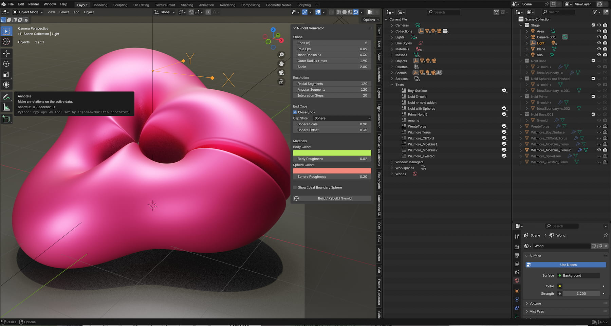
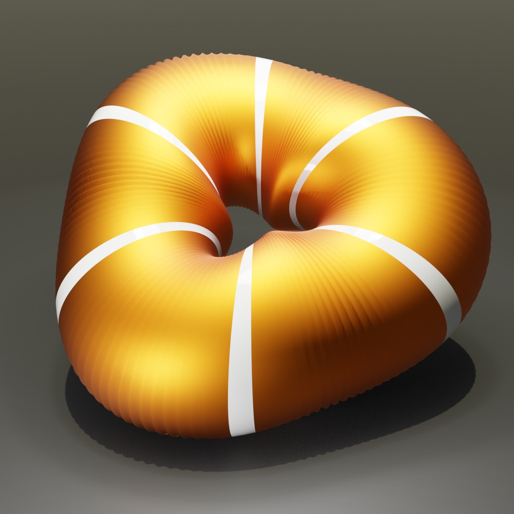
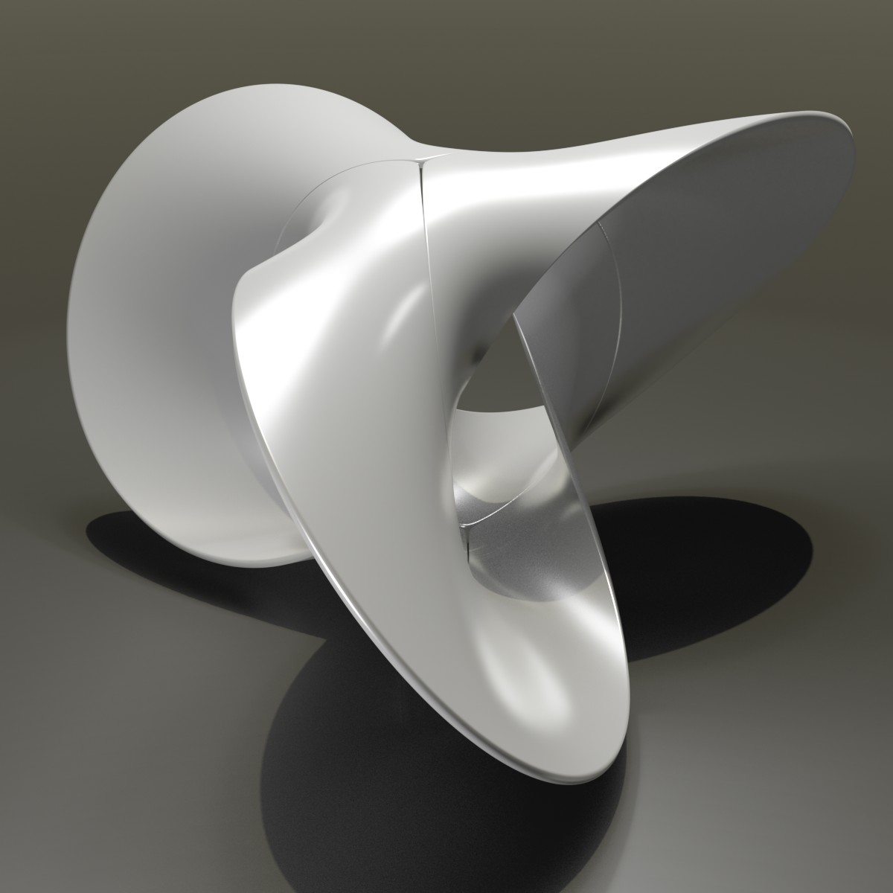
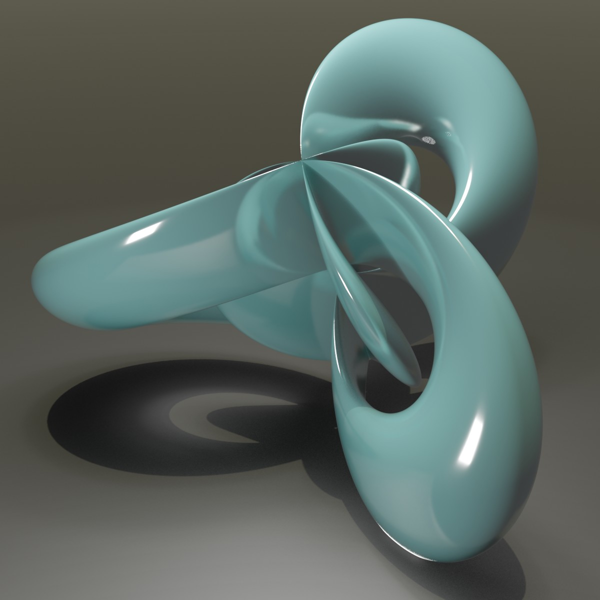
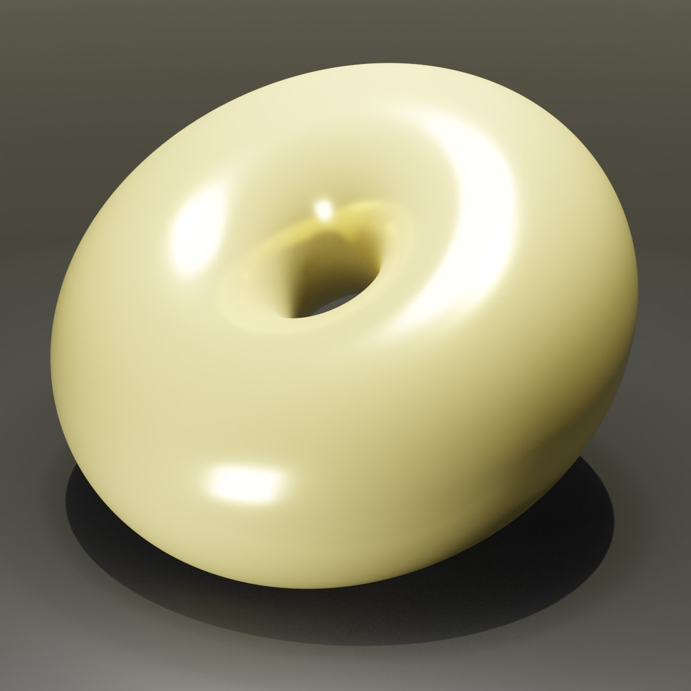
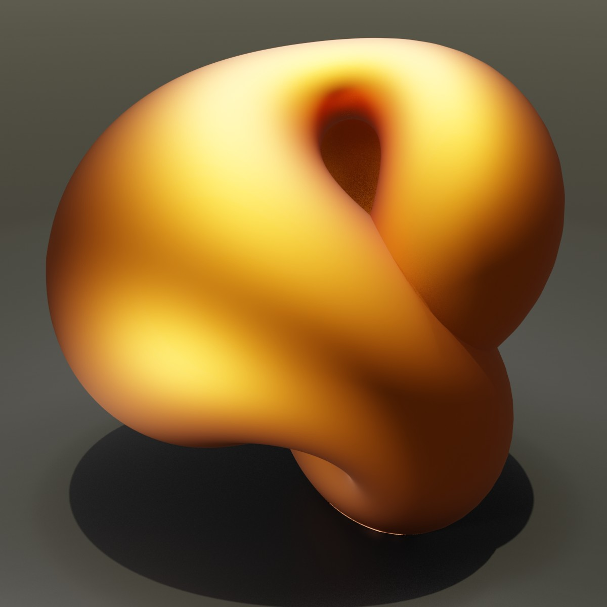
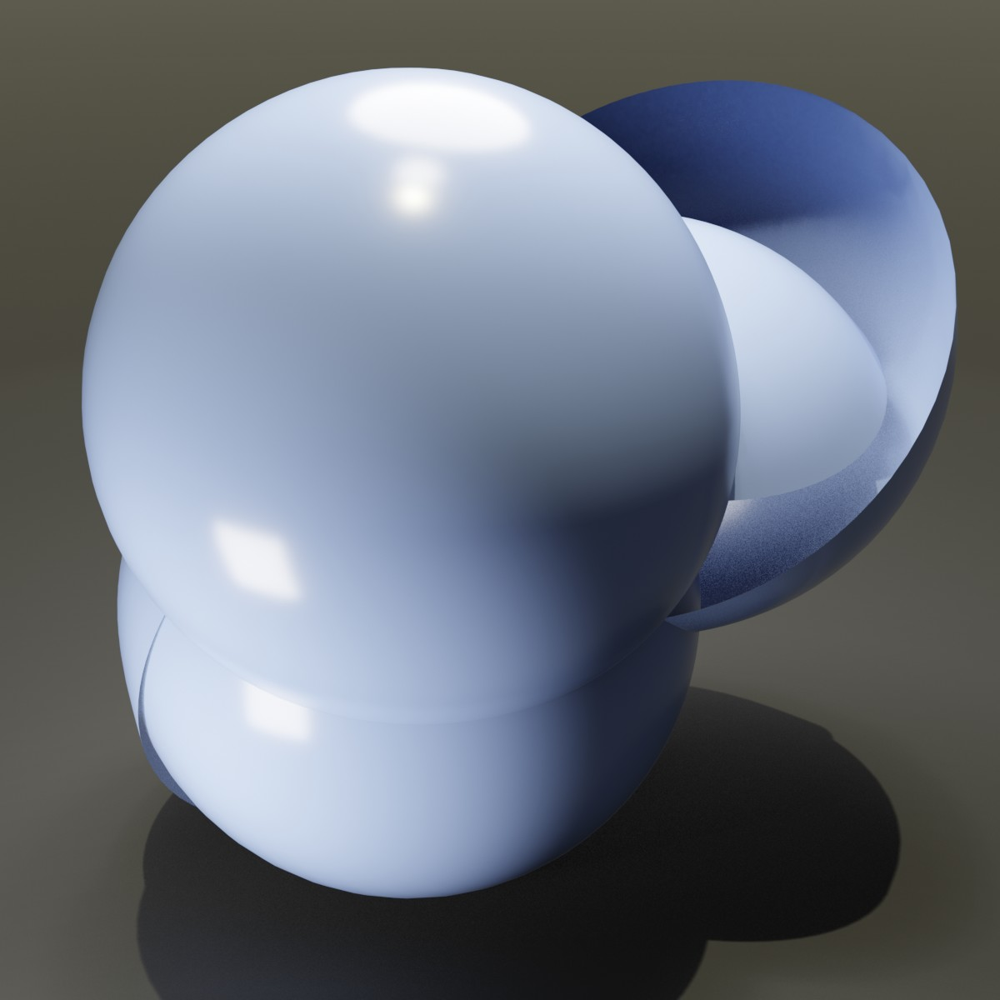
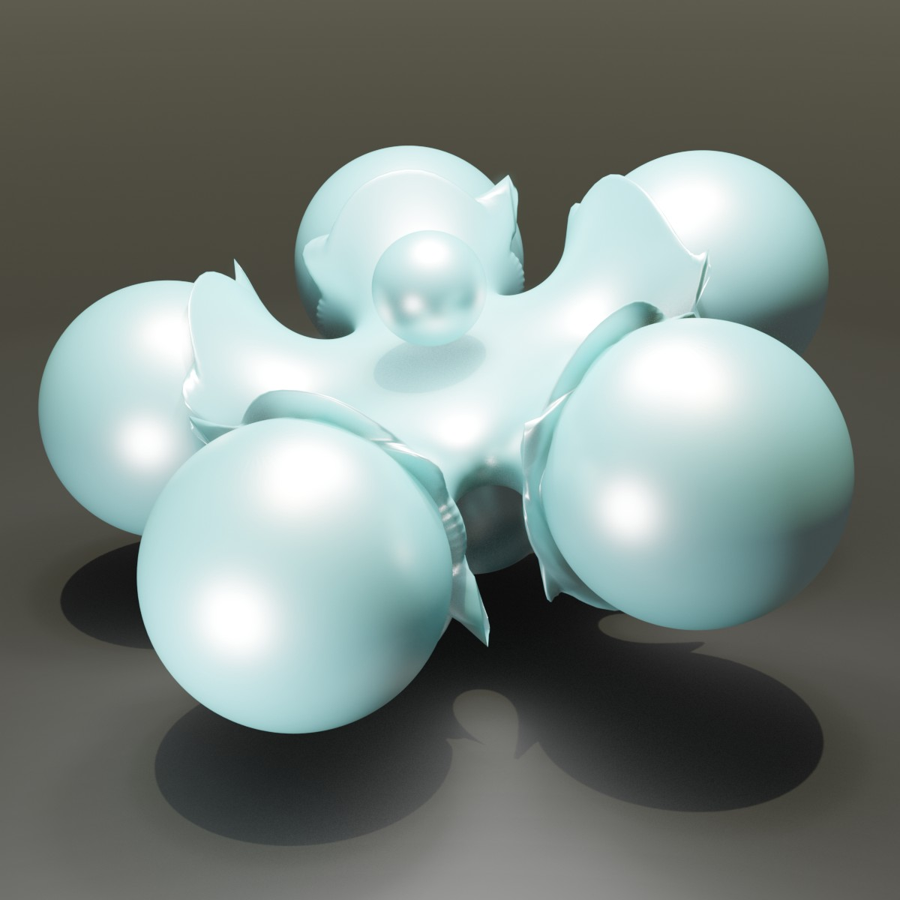
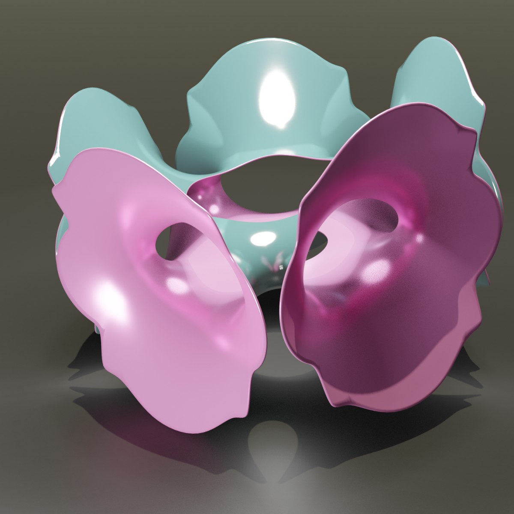
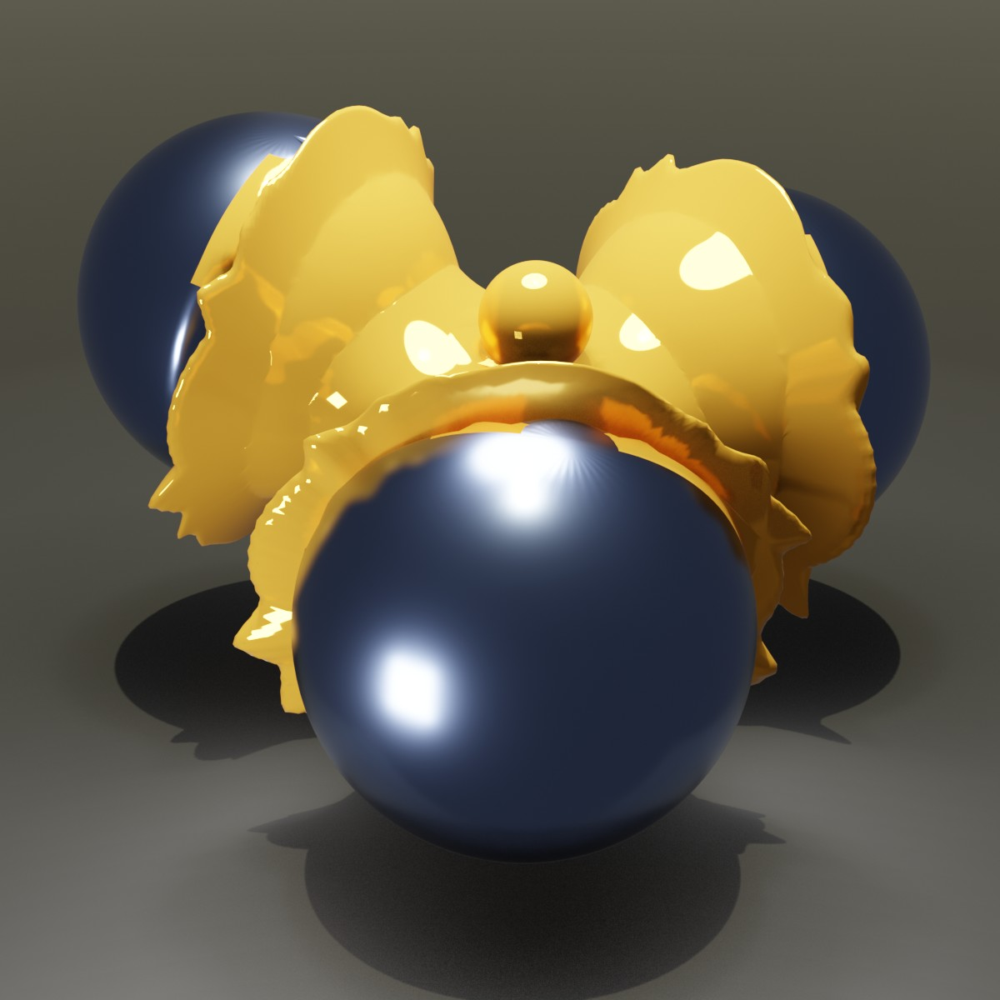

# Project Overview: Various Tori
In this Blender Project File you will find 10 different scripts (and Objects) to generate some interesting Tori. Some are based on the Willmore Torus, some on the N-Noid Surfaces. 
All are more a kind of experimental.

## Background

When I was developing the "Wente" Torus and the "Willmore" Torus, I made several script with the help of Claude.Ai, some fail results were to interesting to delete them.
Specially the N-Noid brings a very good base to develop a add-on from here.

## Screen Shot

## Documentation
The script are easy to handle. In the top / and or in the bottom/ of the script you find a short set of parameter with a short description. Except the N-Noid Generator, this script has a N-Panel like a add-on, with many features to adjust.

| Object | Preview |
| :--- | :--- |
|  |  |
|  |  |
|  |  |
|  |  |
|  |  |

## Release Notes

### v1.0.0 (July 29, 2026)
- **Publishing**: First public upload of this script

## Blender

