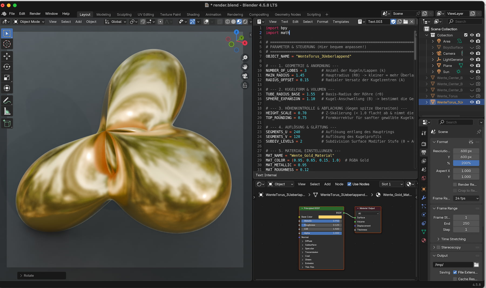
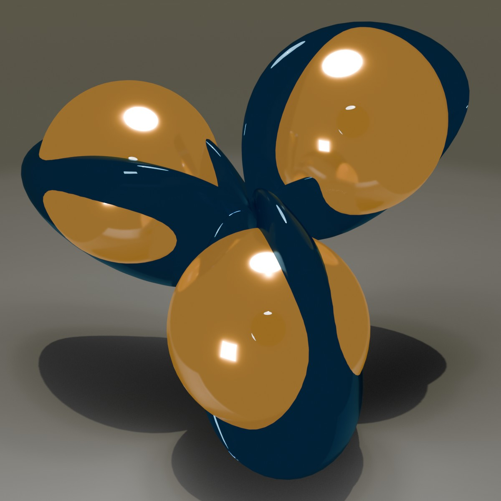

# Project Overview: Wente Tori
The project is a custom Blender 3D Python script that generates two variations of a Wente Torus.

## Background

A Wente torus is a special 3D shape shaped like a donut that has the same mean bending value everywhere, proving that round spheres are not the only closed shapes with this trait. Henry Wente found it in 1984. This is one of the more beautiful corners of differential geometry — constant mean curvature (CMC) tori were exactly the kind of object that broke Heinz Hopf's conjecture in the 1980s.
(Here a: two version to play of a full size version of the 3-Lobe Symmetric Wente Torus)

## Screen Shot

## Documentation
the script is easy to handle. In the top / and or in the bottom/ of the script you find a short set of parameter with a short description. 

| Object | Preview |
| :--- | :--- |
|  |  |

## Release Notes

### v1.0.0 (July 28, 2026)
- **Publishing**: First public upload of this script

## Blender

